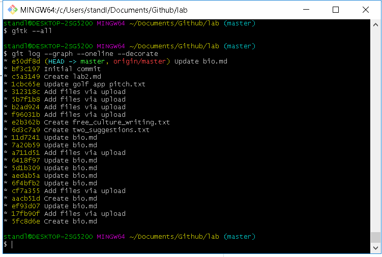
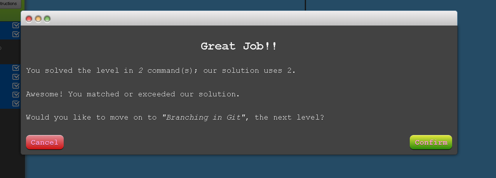
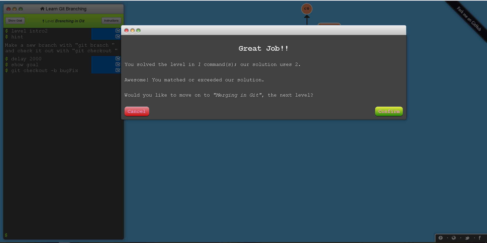
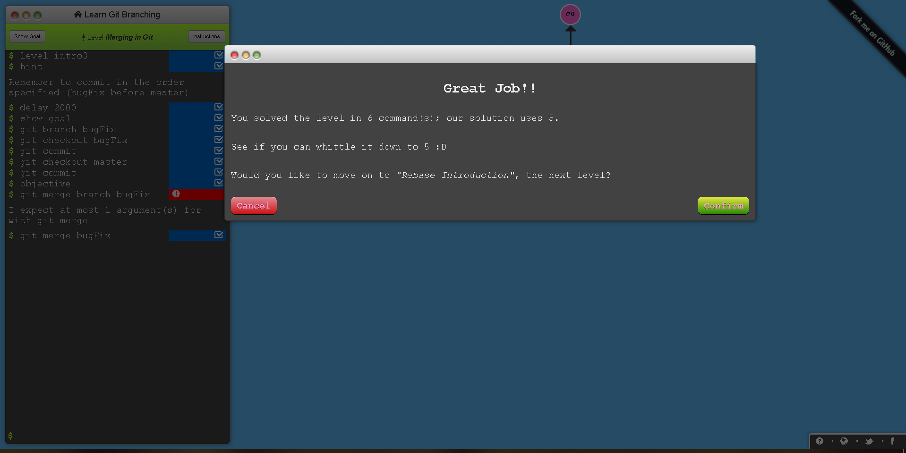
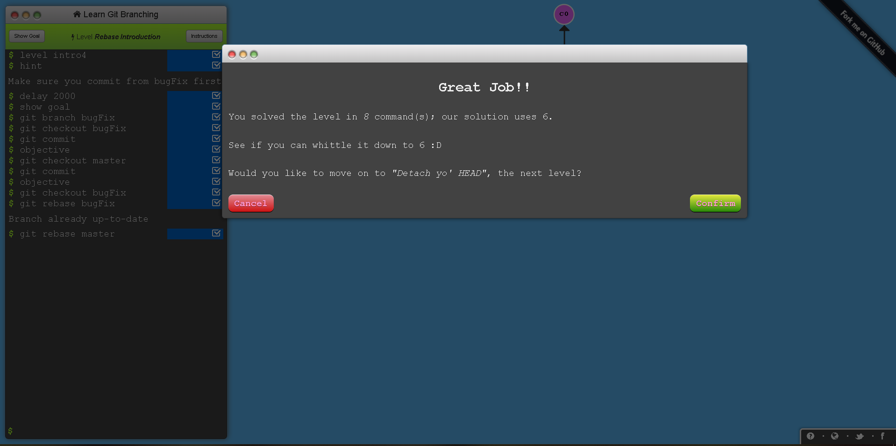

# Part 1
gitk --all 
gitk 
gitlog 

# Part 2
branching 1 question 
branching 2 questoin 
branching 3 question 
branching 4 question 

# Part 3
Pull req repo https://github.com/lucasfs2020/PullReq
Course Project repo https://github.com/lucasfs2020/courseproject
Project Ideas repo https://github.com/lucasfs2020/ProjectIdeas2019
