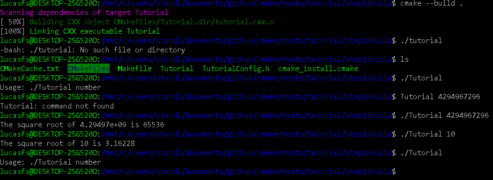
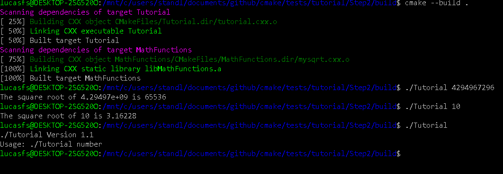
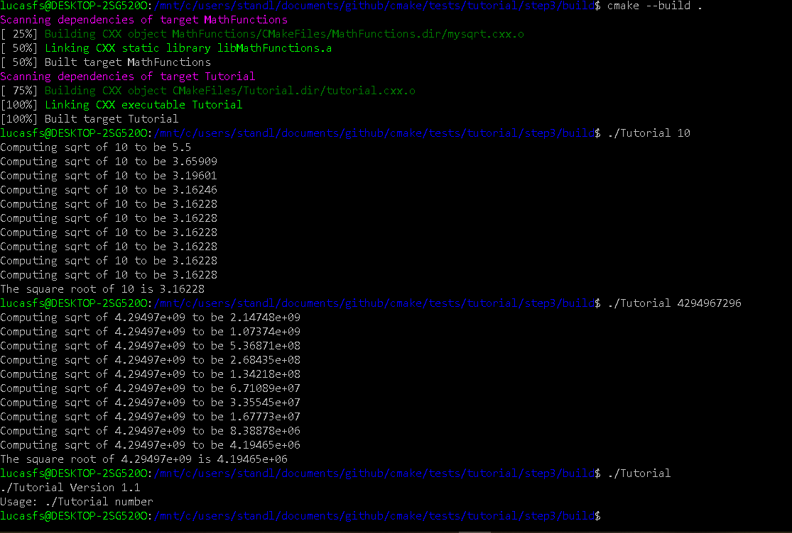

Lab 5 part 1
Photo 
part1 code
cmake list
  cmake_minimum_required(VERSION 3.3)
  project(Tutorial)

  set(Tutorial_VERSION_MAJOR 1)
  set(Tutorial_VERSION_MINOR 0)

  configure_file(
    "${PROJECT_SOURCE_DIR}/TutorialConfig.h.in"
    "${PROJECT_BINARY_DIR}/TutorialConfig.h"
    )

  add_executable(Tutorial tutorial.cxx)

  target_include_directories(Tutorial PUBLIC
                             "${PROJECT_BINARY_DIR}"
                             )
                             
Photo 

part2 code 
cmake list source
cmake_minimum_required(VERSION 3.3)
project(Tutorial)

set(CMAKE_CXX_STANDARD 11)
set(CMAKE_CXX_STANDARD_REQUIRED True)

set(Tutorial_VERSION_MAJOR 1)
set(Tutorial_VERSION_MINOR 0)

configure_file(
  "${PROJECT_SOURCE_DIR}/TutorialConfig.h.in"
  "${PROJECT_BINARY_DIR}/TutorialConfig.h"
  )

add_executable(Tutorial tutorial.cxx)

target_include_directories(Tutorial PUBLIC
                           "${PROJECT_BINARY_DIR}"
                           )

add_subdirectory(MathFunctions)

target_link_libraries(Tutorial ${EXTRA_LIBS})

cmake list mathfunction

add_library(MathFunctions mysqrt.cxx)

Photo 

source cmake

cmake_minimum_required(VERSION 3.3)
project(Tutorial)

set(CMAKE_CXX_STANDARD 11)
set(CMAKE_CXX_STANDARD_REQUIRED True)

option(USE_MYMATH "Use tutorial provided math implementation" ON)

set(Tutorial_VERSION_MAJOR 1)
set(Tutorial_VERSION_MINOR 0)

configure_file(
  "${PROJECT_SOURCE_DIR}/TutorialConfig.h.in"
  "${PROJECT_BINARY_DIR}/TutorialConfig.h"
  )

if(USE_MYMATH)
  add_subdirectory(MathFunctions)
  list(APPEND EXTRA_LIBS MathFunctions)
  list(APPEND EXTRA_INCLUDES "${PROJECT_SOURCE_DIR}/MathFunctions")
endif(USE_MYMATH)

add_executable(Tutorial tutorial.cxx)

target_link_libraries(Tutorial ${EXTRA_LIBS})

target_include_directories(Tutorial PUBLIC
                           "${PROJECT_BINARY_DIR}"
                           ${EXTRA_INCLUDES}
                           )
                           
mathfunction cmake

add_library(MathFunctions mysqrt.cxx)

target_include_directories(MathFunctions INTERFACE ${CMAKE_CURRENT_SOURCE_DIR})

Photo 
Photo 

part 4
cmake source
cmake_minimum_required(VERSION 3.3)
project(Tutorial)

set(CMAKE_CXX_STANDARD 11)
set(CMAKE_CXX_STANDARD_REQUIRED True)

option(USE_MYMATH "Use tutorial provided math implementation" ON)

set(Tutorial_VERSION_MAJOR 1)
set(Tutorial_VERSION_MINOR 0)

configure_file(
  "${PROJECT_SOURCE_DIR}/TutorialConfig.h.in"
  "${PROJECT_BINARY_DIR}/TutorialConfig.h"
  )

if(USE_MYMATH)
  add_subdirectory(MathFunctions)
  list(APPEND EXTRA_LIBS MathFunctions)
endif(USE_MYMATH)

add_executable(Tutorial tutorial.cxx)

target_link_libraries(Tutorial PUBLIC ${EXTRA_LIBS})

target_include_directories(Tutorial PUBLIC
                           "${PROJECT_BINARY_DIR}"
                           )

install (TARGETS Tutorial DESTINATION bin)
install (FILES "${PROJECT_BINARY_DIR}/TutorialConfig.h"
	 DESTINATION include
	 )

mathfunction cmake
add_library(MathFunctions mysqrt.cxx)

target_include_directories(MathFunctions
          INTERFACE ${CMAKE_CURRENT_SOURCE_DIR}
          )

install (TARGETS MathFunctions DESTINATION bin)
install (FILES MathFunctions.h DESTINATION include)

Photo 

part 5
cmake source

cmake_minimum_required(VERSION 3.3)
project(Tutorial)

set(CMAKE_CXX_STANDARD 11)
set(CMAKE_CXX_STANDARD_REQUIRED True)

option(USE_MYMATH "Use tutorial provided math implementation" ON)

set(Tutorial_VERSION_MAJOR 1)
set(Tutorial_VERSION_MINOR 0)

configure_file(
  "${PROJECT_SOURCE_DIR}/TutorialConfig.h.in"
  "${PROJECT_BINARY_DIR}/TutorialConfig.h"
  )

if(USE_MYMATH)
  add_subdirectory(MathFunctions)
  list(APPEND EXTRA_LIBS MathFunctions)
endif()

add_executable(Tutorial tutorial.cxx)
target_link_libraries(Tutorial PUBLIC ${EXTRA_LIBS})

target_include_directories(Tutorial PUBLIC
                           "${PROJECT_BINARY_DIR}"
                           )
			   
install(TARGETS Tutorial DESTINATION bin)
install(FILES "${PROJECT_BINARY_DIR}/TutorialConfig.h"
  DESTINATION include
  )

enable_testing()

add_test(NAME Runs COMMAND Tutorial 25)

add_test(NAME Usage COMMAND Tutorial)
set_tests_properties(Usage
  PROPERTIES PASS_REGULAR_EXPRESSION "Usage:.*number"
  )

function(do_test target arg result)
  add_test(NAME Comp${arg} COMMAND ${target} ${arg})
  set_tests_properties(Comp${arg}
    PROPERTIES PASS_REGULAR_EXPRESSION ${result}
    )
endfunction(do_test)

do_test(Tutorial 4 "4 is 2")
do_test(Tutorial 9 "9 is 3")
do_test(Tutorial 5 "5 is 2.236")
do_test(Tutorial 7 "7 is 2.645")
do_test(Tutorial 25 "25 is 5")
do_test(Tutorial -25 "-25 is [-nan|nan|0]")
do_test(Tutorial 0.0001 "0.0001 is 0.01")

mathfunction cmake
add_library(MathFunctions mysqrt.cxx)

target_include_directories(MathFunctions
          INTERFACE ${CMAKE_CURRENT_SOURCE_DIR}
	  PRIVATE ${Tutorial_BINARY_DIR}
          )

install(TARGETS MathFunctions DESTINATION lib)
install(FILES MathFunctions.h DESTINATION include)

Part 2

hand made makefile

all: static_block dynamic_block

dynamic_block: program.o shared_lib.so
	cc program.o shared_lib.so -o dynamic -Wl,-rpath='$$ORIGIN'

static_block: program.c block.o
	cc program.c block.o -o static_block

shared_lib.so: block.o
	cc -shared -o shared_lib.so block.o

program.o: program.c
	cc -fPIC -c program.c -o program.o
	
block.o: source/block.c
	cc -fPIC -c source/block.c -o block.o
  
cmake list
cmake_minimum_required(VERSION 3.3)
project(lab_example)

set(CMAKE_CXX_STANDARD 11)
set(CMAKE_CXX_STANDARD_REQUIRED True)

add_library(myLib_shared SHARED source/block.c)
add_library(myLib_static STATIC source/block.c)

add_executable(dynamic program.c)
target_link_libraries(dynamic myLib_shared)

add_executable(static program.c)
target_link_libraries(static myLib_static)

cmake makefile

# CMAKE generated file: DO NOT EDIT!
# Generated by "Unix Makefiles" Generator, CMake Version 3.10

# Default target executed when no arguments are given to make.
default_target: all

.PHONY : default_target

# Allow only one "make -f Makefile2" at a time, but pass parallelism.
.NOTPARALLEL:

#=============================================================================
# Special targets provided by cmake.

# Disable implicit rules so canonical targets will work.
.SUFFIXES:

# Remove some rules from gmake that .SUFFIXES does not remove.
SUFFIXES =

.SUFFIXES: .hpux_make_needs_suffix_list

# Suppress display of executed commands.
$(VERBOSE).SILENT:

# A target that is always out of date.
cmake_force:

.PHONY : cmake_force

#=============================================================================
# Set environment variables for the build.

# The shell in which to execute make rules.
SHELL = /bin/sh

# The CMake executable.
CMAKE_COMMAND = /usr/bin/cmake

# The command to remove a file.
RM = /usr/bin/cmake -E remove -f

# Escaping for special characters.
EQUALS = =

# The top-level source directory on which CMake was run.
CMAKE_SOURCE_DIR = /mnt/c/users/standl/documents/github/CSCI-49XX-OpenSource/Modules/BuildSystems/Lab-Example

# The top-level build directory on which CMake was run.
CMAKE_BINARY_DIR = /mnt/c/users/standl/documents/github/CSCI-49XX-OpenSource/Modules/BuildSystems/Lab-Example/build2

#=============================================================================
# Targets provided globally by CMake.

# Special rule for the target edit_cache
edit_cache:
	@$(CMAKE_COMMAND) -E cmake_echo_color --switch=$(COLOR) --cyan "No interactive CMake dialog available..."
	/usr/bin/cmake -E echo No\ interactive\ CMake\ dialog\ available.
.PHONY : edit_cache

# Special rule for the target edit_cache
edit_cache/fast: edit_cache

.PHONY : edit_cache/fast

# Special rule for the target rebuild_cache
rebuild_cache:
	@$(CMAKE_COMMAND) -E cmake_echo_color --switch=$(COLOR) --cyan "Running CMake to regenerate build system..."
	/usr/bin/cmake -H$(CMAKE_SOURCE_DIR) -B$(CMAKE_BINARY_DIR)
.PHONY : rebuild_cache

# Special rule for the target rebuild_cache
rebuild_cache/fast: rebuild_cache

.PHONY : rebuild_cache/fast

# The main all target
all: cmake_check_build_system
	$(CMAKE_COMMAND) -E cmake_progress_start /mnt/c/users/standl/documents/github/CSCI-49XX-OpenSource/Modules/BuildSystems/Lab-Example/build2/CMakeFiles /mnt/c/users/standl/documents/github/CSCI-49XX-OpenSource/Modules/BuildSystems/Lab-Example/build2/CMakeFiles/progress.marks
	$(MAKE) -f CMakeFiles/Makefile2 all
	$(CMAKE_COMMAND) -E cmake_progress_start /mnt/c/users/standl/documents/github/CSCI-49XX-OpenSource/Modules/BuildSystems/Lab-Example/build2/CMakeFiles 0
.PHONY : all

# The main clean target
clean:
	$(MAKE) -f CMakeFiles/Makefile2 clean
.PHONY : clean

# The main clean target
clean/fast: clean

.PHONY : clean/fast

# Prepare targets for installation.
preinstall: all
	$(MAKE) -f CMakeFiles/Makefile2 preinstall
.PHONY : preinstall

# Prepare targets for installation.
preinstall/fast:
	$(MAKE) -f CMakeFiles/Makefile2 preinstall
.PHONY : preinstall/fast

# clear depends
depend:
	$(CMAKE_COMMAND) -H$(CMAKE_SOURCE_DIR) -B$(CMAKE_BINARY_DIR) --check-build-system CMakeFiles/Makefile.cmake 1
.PHONY : depend

#=============================================================================
# Target rules for targets named static

# Build rule for target.
static: cmake_check_build_system
	$(MAKE) -f CMakeFiles/Makefile2 static
.PHONY : static

# fast build rule for target.
static/fast:
	$(MAKE) -f CMakeFiles/static.dir/build.make CMakeFiles/static.dir/build
.PHONY : static/fast

#=============================================================================
# Target rules for targets named dynamic

# Build rule for target.
dynamic: cmake_check_build_system
	$(MAKE) -f CMakeFiles/Makefile2 dynamic
.PHONY : dynamic

# fast build rule for target.
dynamic/fast:
	$(MAKE) -f CMakeFiles/dynamic.dir/build.make CMakeFiles/dynamic.dir/build
.PHONY : dynamic/fast

#=============================================================================
# Target rules for targets named myLib_shared

# Build rule for target.
myLib_shared: cmake_check_build_system
	$(MAKE) -f CMakeFiles/Makefile2 myLib_shared
.PHONY : myLib_shared

# fast build rule for target.
myLib_shared/fast:
	$(MAKE) -f CMakeFiles/myLib_shared.dir/build.make CMakeFiles/myLib_shared.dir/build
.PHONY : myLib_shared/fast

#=============================================================================
# Target rules for targets named myLib_static

# Build rule for target.
myLib_static: cmake_check_build_system
	$(MAKE) -f CMakeFiles/Makefile2 myLib_static
.PHONY : myLib_static

# fast build rule for target.
myLib_static/fast:
	$(MAKE) -f CMakeFiles/myLib_static.dir/build.make CMakeFiles/myLib_static.dir/build
.PHONY : myLib_static/fast

program.o: program.c.o

.PHONY : program.o

# target to build an object file
program.c.o:
	$(MAKE) -f CMakeFiles/static.dir/build.make CMakeFiles/static.dir/program.c.o
	$(MAKE) -f CMakeFiles/dynamic.dir/build.make CMakeFiles/dynamic.dir/program.c.o
.PHONY : program.c.o

program.i: program.c.i

.PHONY : program.i

# target to preprocess a source file
program.c.i:
	$(MAKE) -f CMakeFiles/static.dir/build.make CMakeFiles/static.dir/program.c.i
	$(MAKE) -f CMakeFiles/dynamic.dir/build.make CMakeFiles/dynamic.dir/program.c.i
.PHONY : program.c.i

program.s: program.c.s

.PHONY : program.s

# target to generate assembly for a file
program.c.s:
	$(MAKE) -f CMakeFiles/static.dir/build.make CMakeFiles/static.dir/program.c.s
	$(MAKE) -f CMakeFiles/dynamic.dir/build.make CMakeFiles/dynamic.dir/program.c.s
.PHONY : program.c.s

source/block.o: source/block.c.o

.PHONY : source/block.o

# target to build an object file
source/block.c.o:
	$(MAKE) -f CMakeFiles/myLib_shared.dir/build.make CMakeFiles/myLib_shared.dir/source/block.c.o
	$(MAKE) -f CMakeFiles/myLib_static.dir/build.make CMakeFiles/myLib_static.dir/source/block.c.o
.PHONY : source/block.c.o

source/block.i: source/block.c.i

.PHONY : source/block.i

# target to preprocess a source file
source/block.c.i:
	$(MAKE) -f CMakeFiles/myLib_shared.dir/build.make CMakeFiles/myLib_shared.dir/source/block.c.i
	$(MAKE) -f CMakeFiles/myLib_static.dir/build.make CMakeFiles/myLib_static.dir/source/block.c.i
.PHONY : source/block.c.i

source/block.s: source/block.c.s

.PHONY : source/block.s

# target to generate assembly for a file
source/block.c.s:
	$(MAKE) -f CMakeFiles/myLib_shared.dir/build.make CMakeFiles/myLib_shared.dir/source/block.c.s
	$(MAKE) -f CMakeFiles/myLib_static.dir/build.make CMakeFiles/myLib_static.dir/source/block.c.s
.PHONY : source/block.c.s

# Help Target
help:
	@echo "The following are some of the valid targets for this Makefile:"
	@echo "... all (the default if no target is provided)"
	@echo "... clean"
	@echo "... depend"
	@echo "... static"
	@echo "... dynamic"
	@echo "... edit_cache"
	@echo "... myLib_shared"
	@echo "... rebuild_cache"
	@echo "... myLib_static"
	@echo "... program.o"
	@echo "... program.i"
	@echo "... program.s"
	@echo "... source/block.o"
	@echo "... source/block.i"
	@echo "... source/block.s"
.PHONY : help

#=============================================================================
# Special targets to cleanup operation of make.

# Special rule to run CMake to check the build system integrity.
# No rule that depends on this can have commands that come from listfiles
# because they might be regenerated.
cmake_check_build_system:
	$(CMAKE_COMMAND) -H$(CMAKE_SOURCE_DIR) -B$(CMAKE_BINARY_DIR) --check-build-system CMakeFiles/Makefile.cmake 0
.PHONY : cmake_check_build_system

When I ran the two files made by cmake, the two ran in a similar time, and looked the exact same.
Photo [new](static_and_dynamic_run.PNG)

However, when I compared the size, the dynamic is much smaller compared to the static took up slightly less space than the dynamic.
Photo [new](static_vs_dynamic_2.PNG)
