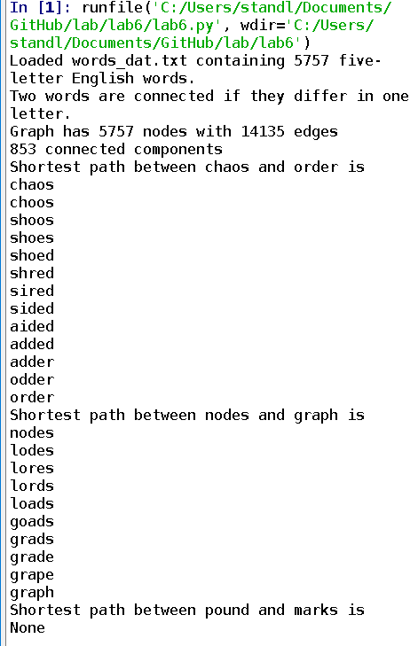
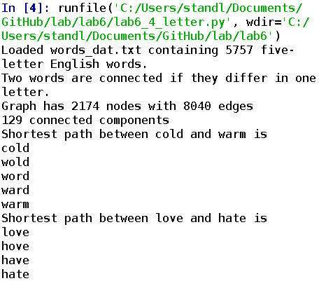
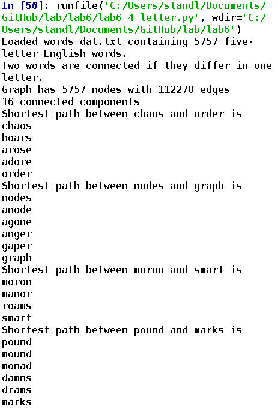
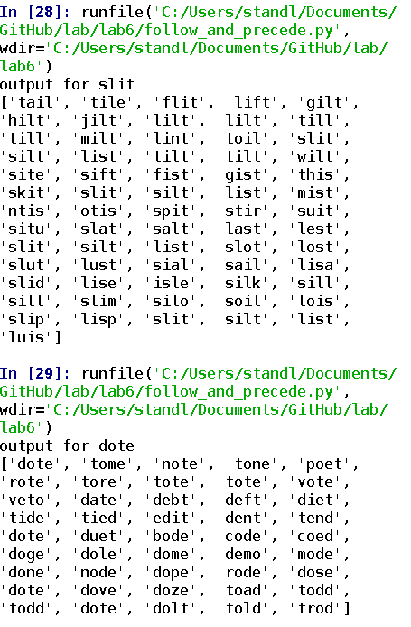
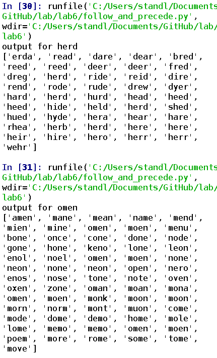
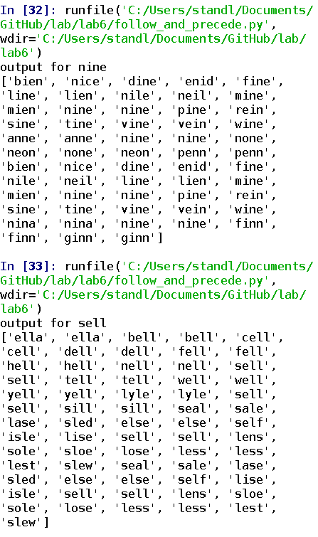
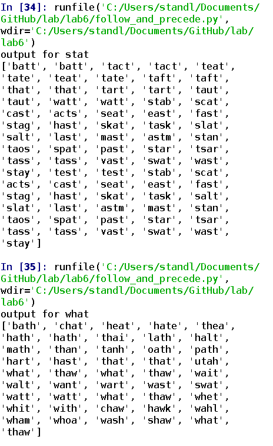

Five letter pair results
Photo 

four letter pair code
link to four letter code [link](https://github.com/lucasfs2020/lab/blob/master/lab6/lab6_4_letter.py)

four letter pair output
Photo 

unordered code
link to unordererd code [link](https://github.com/lucasfs2020/lab/blob/master/lab6/lab6_unordered.py)

unorderd code output
Photo 

precede/follow code
link to preced/follow code [link](https://github.com/lucasfs2020/lab/blob/master/lab6/follow_and_precede.py)

precede/follow output
Photo 
Photo 
Photo 
Photo 
