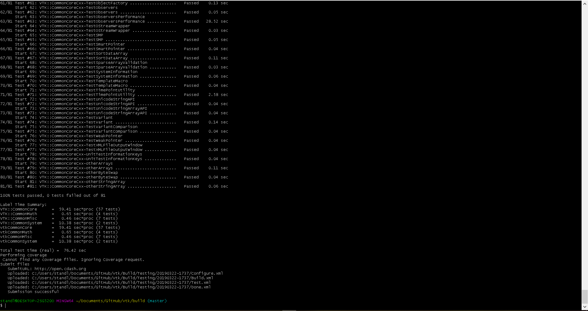

# Part 1
I was able to succesfully configure, generate, and build the cmake for vtk 

# Part 2
I was able to run the tests succesfully and they passed 

# Part 3
Upon added the new test, it failed and all others ran succesfully 

# Part 4

# Part 5
