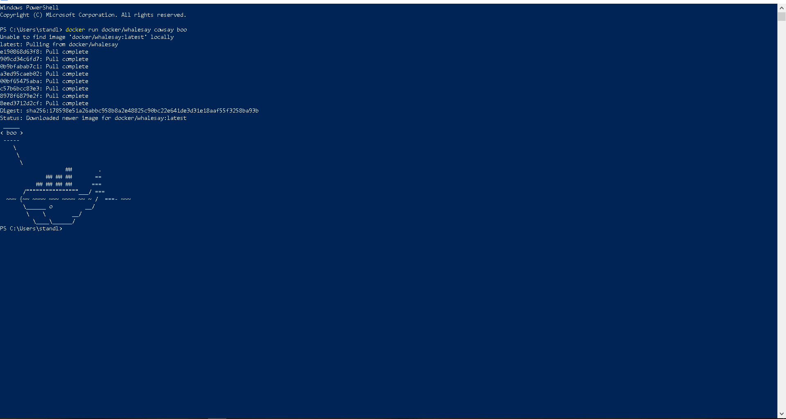
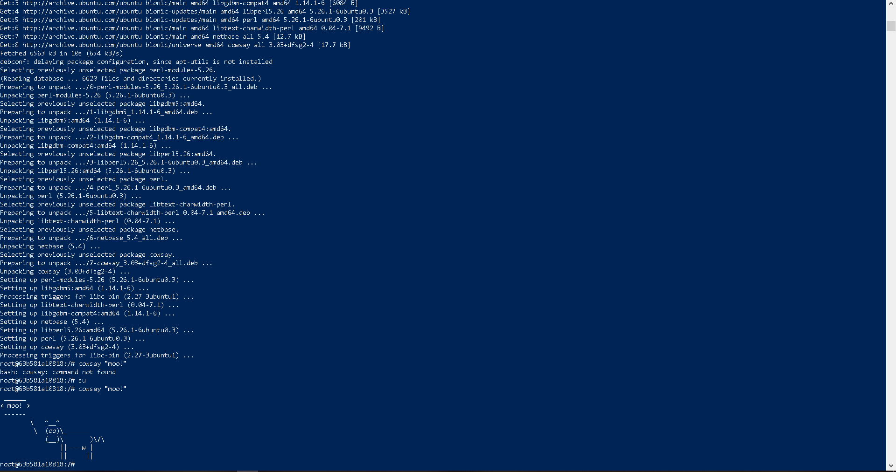
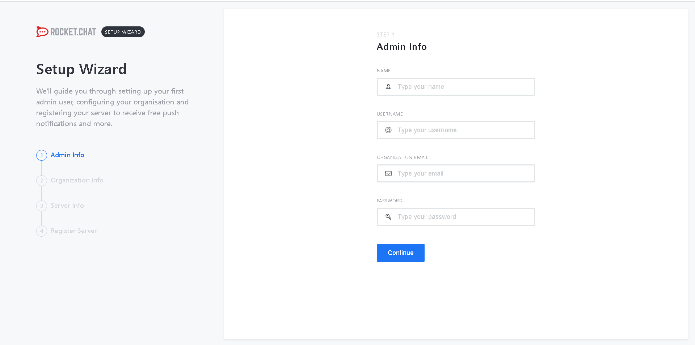
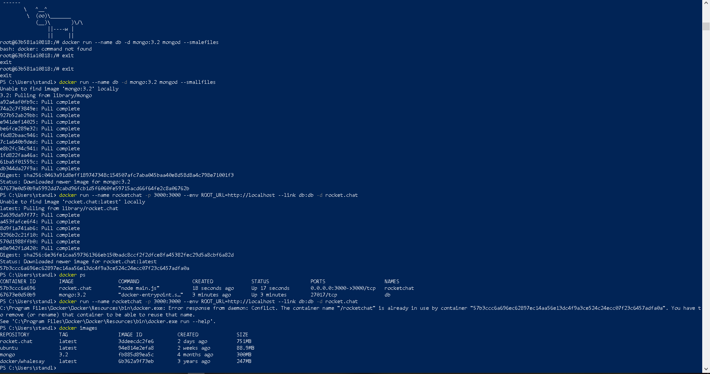
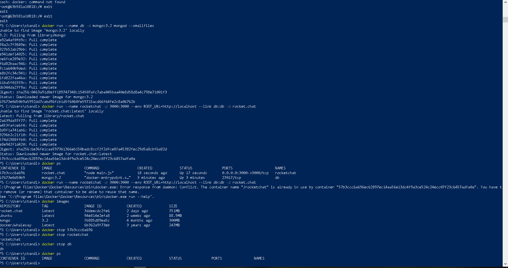
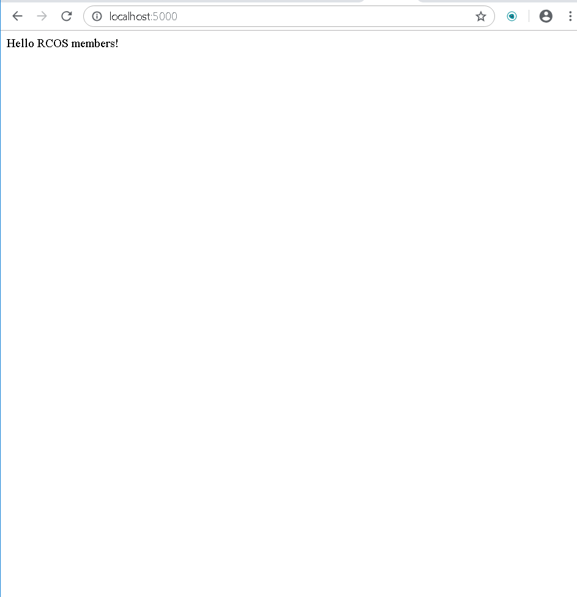
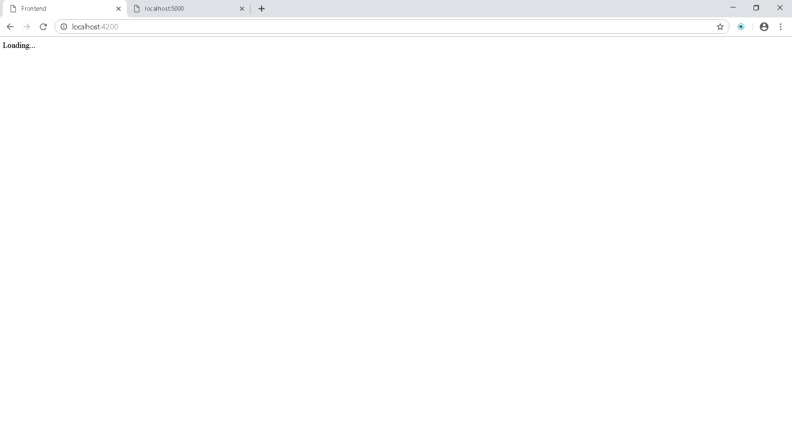
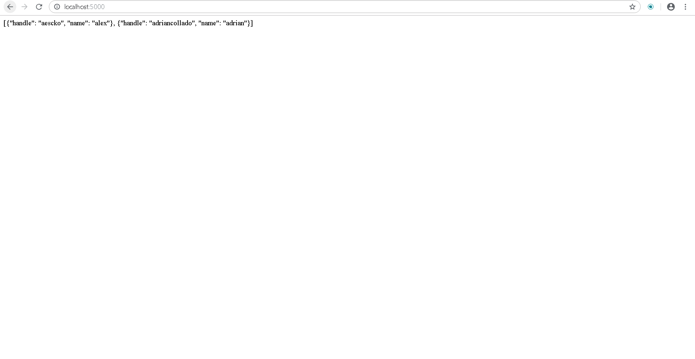

Upon getting each example to work, I took a screenshot. I had to use wsl to edit certain files and ran docker in a powershell.

# Example 0

# Example 1

# Example 2

# Example 3

# Example 4

